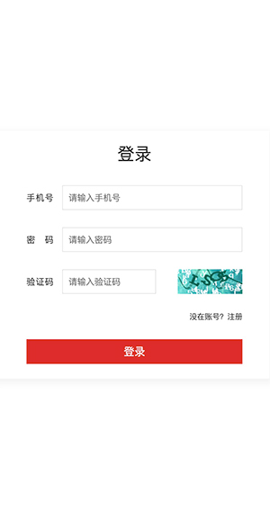
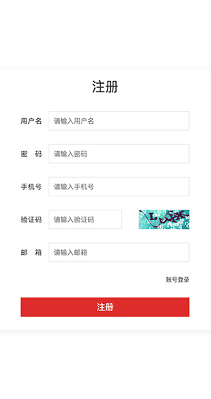
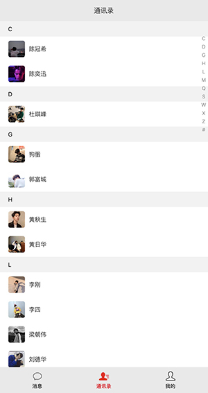
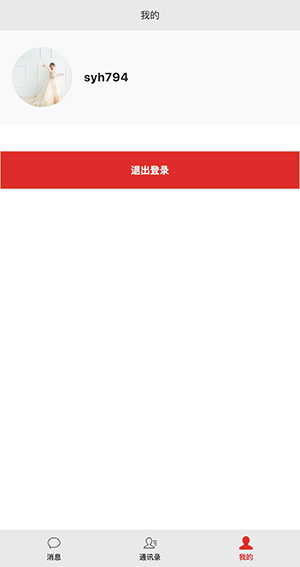
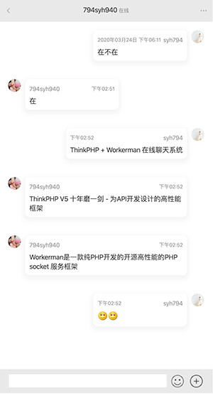

ThinkPHP + Workerman在线聊天系统
==============================
1、Mysql数据结构文件在public/mysql目录下

2、运行此项目 先要启动Workerman服务
```
以debug（调试）方式启动
/data/app/php72/bin/php(php运行路径根据自己的路径修改) chat_server/vendor/getewayworker/start.php(start.php文件路径根据自己的项目路径修改) start

以daemon（守护进程）方式启动
/data/app/php72/bin/php(php运行路径根据自己的路径修改) chat_server/vendor/getewayworker/start.php(start.php文件路径根据自己的项目路径修改) start -d

start : 启动
stop : 停止
restart : 重启
reload : 平滑重启
status : 查看状态

debug和daemon方式区别
* 以debug方式启动，代码中echo、var_dump、print等打印函数会直接输出在终端。
* 以daemon方式启动，代码中echo、var_dump、print等打印会默认重定向到/dev/null文件，可以通过设置Worker::$stdoutFile = '/your/path/file';来设置这个文件路径。
* 以debug方式启动，终端关闭后workerman会随之关闭并退出。
* 以daemon方式启动，终端关闭后workerman继续后台正常运行。
```

3、效果图如下所示

* ***登录    注册***




* ***消息列表   通讯录    我的***





* ***聊天内容***




特此鸣谢 ThinkPHP和Workerman框架开发团队所提供的开源开发框架
